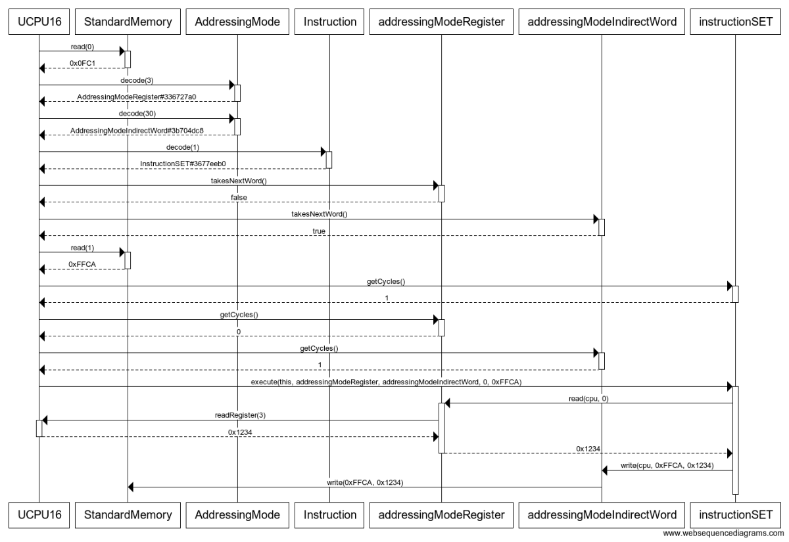
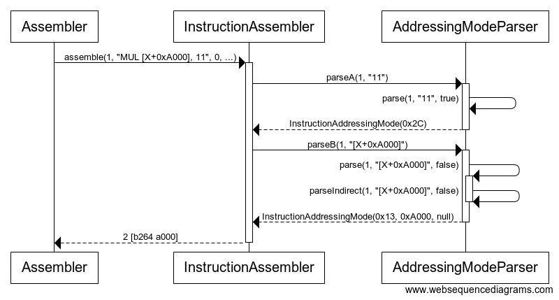
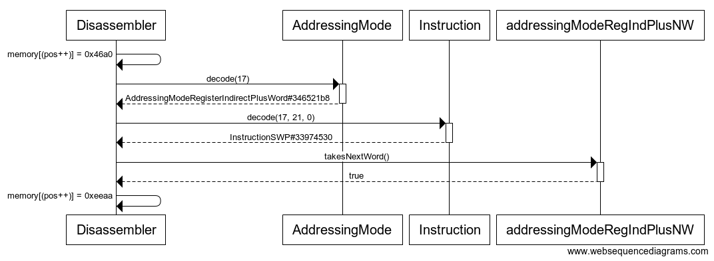
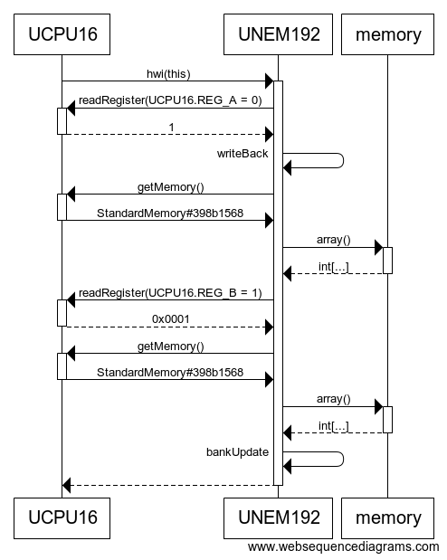

# Sekvenssikaavioita

## SET-käsky

Alla olevassa kaaviossa suoritetaan käsky `SET [0xFFCA], X` (binäärinä `0FC1 FFCA`). Kyseisen käskyn tarkoituksena on ottaa suorittimen rekisteristä X arvo ja tallettaa se muistipaikkaan 0xFFCA.
(decode-kutsun parametrit syntyvät muistista haetuista arvoista tietyillä binäärioperaatioilla.)

## Konekielelle kääntäminen

Alla käännetään käsky `MUL [X+0xA000], 11` konekielelle. 

## Konekieleltä kääntäminen

Alla käännetään konekielen käsky binääristä `46A0 EEAA` symboliseen muotoon `SWP [B+0xEEAA]`. Sillä luokka hakee omasta taulukostaan arvot, niiden hakua ei ole kuvattu kaaviossa.
(decode-kutsun parametrit syntyvät muistista haetuista arvoista tietyillä binäärioperaatioilla.)

## HWI

Alla olevassa kaaviossa lähetetään laitteistokeskeytys UNEM192-lisämuistilaitteelle. Laite tulkitsee käskyn, jossa
yksi muistialue vaihdetaan toiselle sivulle. writeBack()- ja bankUpdate()-kutsut suorittavat kaaviosta pois
jätettyjä System.arraycopy-kutsuja hoitaakseen varsinaisen työn.

