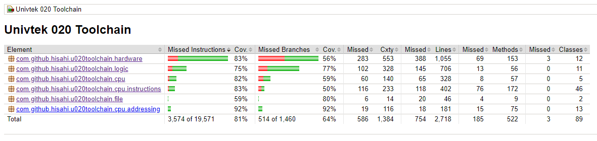

# Testaus
Ohjelma sisältää sekä yksikkötestit ja integraatiotestit JUnit:lla että järjestelmätason testin, joka ajetaan suorittamalla ohjelma. Tämä suorittaa sisäisen BASIC-tulkin, jonka suorittaminen oikein on yksi emulaattorin päätehtävistä.

## Yksikkö- ja integraatiotestaus
JUnit-testejä on yhteensä 249 kappaletta, ja ne testaavat suurinta osaa sovelluksen logiikasta: suoritinta, lisälaitteita sekä kääntäjiä. 

Suoritinta testaavat `UCPU16Test`, käskyjä `AddressingModeTest`, `BinaryInstructionTest`, `BranchInstructionTest`, `UnaryInstructionTest`, kääntäjiä `AssemblerTest` ja `DisassemblerTest`, lisälaitteita `ClockTest`, `KeyboardTest`, `M35FDTest`, `UNCD321Test`, `UNTM200Test` sekä muuta toiminnallisuutta `ConfigTest` (asetustiedostojen lataus), `I18nTest` (kielitiedoston lataus sekä kääntäminen) ja `HighResolutionTimerTest` (CPU-kello).

Testaamatta ovat jääneet pari hankalammin testattavaa lisälaitetta: UNMS001-hiiri sekä UNAC810-äänikortti. Erinäisiä virhetilanteita ei ole myöskään testattu kaikkialta.

## Järjestelmätestaus
Järjestelmätestaus on suoritettu manuaalisesti. Ohjelma toimii sekä Windows- että Linux-järjestelmillä oikein tyhjässä kansiossa sekä osaa suorittaa BASIC-tulkin toimintoja oikein.

# Toiminnallisuus
[Vaatimusmäärittelyn](vaatimusmaarittely.md) mukaiset toiminnallisuudet löytyvät sovelluksesta.

